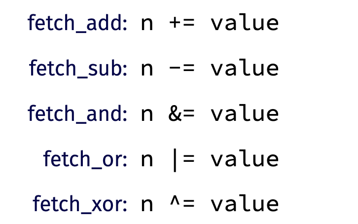
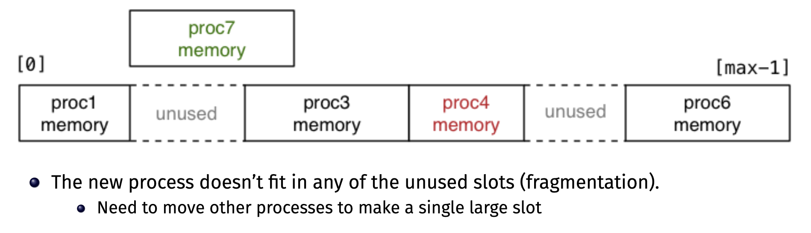

# COMP1521 Notes


### Two's Complement
Two's complement is a way of representing signed integers in binary. It is the most common way of representing signed integers in computers.

To convert a positive number to two's complement, we simply convert it to binary. For example, to convert 5 to two's complement, we convert 5 to binary, which is ```101```.

To convert a negative number to two's complement, we first convert it to binary, then invert all the bits, then add 1. For example, to convert -5 to two's complement, we first convert 5 to binary, which is ```101```. Then we invert all the bits, which is ```010```. Then we add 1, which is ```011```. Hence, -5 in two's complement is ```011```.

For a more intuitive understanding of this representation, refer to this [blog post](https://www.ralismark.xyz/posts/twos-complement).

<br>

### Floating Point
**Exponential Representation - IEEE 754**
Floats are stored using a representation that is quite similar to scientific notation.

Consider the float ```10.6875```. This can be represented as ```1.06875``` in base 10 scientific notation. 

The IEEE 754 standard uses base 2 (binary) or base 10 (decimal), but we will only be looking at base 2.

```10.6875``` in base 2 scientific notation is ```1.0101011 x 2^11```. 

A bit of terminology: The number before the ```x``` is `1.0101011` called the **mantissa**. The **exponent** is the power of 2 that the mantissa is multiplied by. In this case, the exponent is `11`.

Although we could also represent this as ```10.101011 x 2^10```, by convention, $1 \leq \text{mantissa} \lt 2$. This is called **normalisation**. This is done to ensure that the first bit of the mantissa is always 1. Hence, the first bit of the mantissa does not need to be stored, and therefore we can store more significant digits in the mantissa.





Important to remember
- Do not use `==` and `!=` with floating point numbers, as this may cause unexpected behavior due to floating point error. Instead, calculate whether the difference between the two numbers is less than a certain threshold.


<br>


### Unicode and UTF-8
**Unicode** is a standard that assigns a unique number to every character in every language. It is a superset of ASCII, which only contains characters in the English language.

**UTF-8** is a way of encoding Unicode characters into bytes. UTF-8 is a variable length encoding, which means that each character can be represented by a different number of bytes. UTF-8 is backwards compatible with ASCII, which means that ASCII characters can be represented by a single byte in UTF-8.

**UTF-8 Layout**


Explanation of the layout:
- A single UTF-8 character can be anywhere from 1 to 4 bytes long.
- If the first bit is 0, then the character is a single byte character. This also means it is an ASCII character.
- If the first bit is 1, then the character is a multi-byte character.
- The number of bytes in a multi-byte character is determined by the number of leading 1s in the first byte. For example, if the first byte is `1110xxxx`, then the character is 3 bytes long.


<br>

### Processes