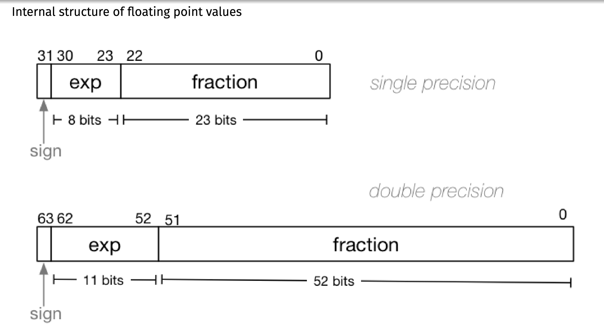
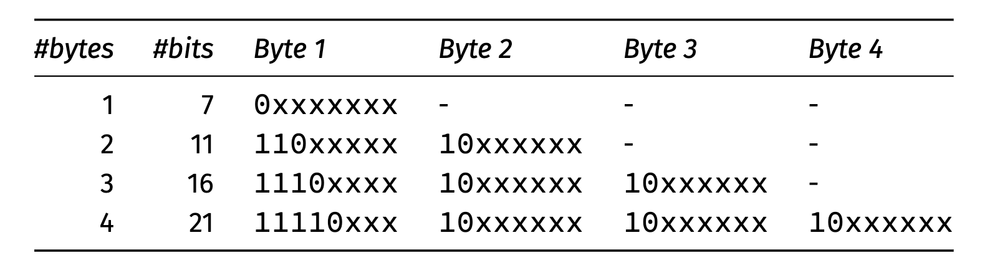
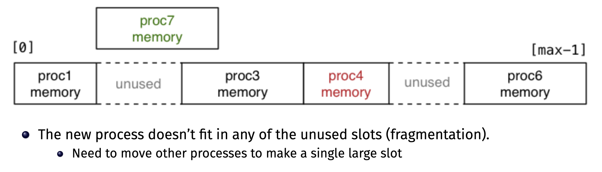

# COMP1521 Notes

## Introduction
This document explains some key concepts taught in COMP1521. 

It is not a replacement for the lectures, but rather a supplement to them. It is recommended that you attend/watch the lectures first, then read these notes to get a better understanding of the content.

These notes are not comprehensive, and do not cover all the course content. It mostly consists of concepts that I personally found difficult to understand, or believed required further explanation.

If you would like a more complete set of notes, refer to the lecture slides on the [course webpage](https://cgi.cse.unsw.edu.au/~cs1521).

If you find any errors in these notes, please let me know by creating an issue on the [GitHub repository](https://github.com/jasminwu/1521-notes).


<br>

## Table of Contents
- [COMP1521 Notes](#comp1521-notes)
  - [Introduction](#introduction)
  - [Table of Contents](#table-of-contents)
  - [Two's Complement](#twos-complement)
  - [Floating Point](#floating-point)
    - [Exponent Bias](#exponent-bias)
    - [Single Precision vs Double Precision](#single-precision-vs-double-precision)
    - [Bits in a Float](#bits-in-a-float)
    - [Exponential Representation - IEEE 754](#exponential-representation---ieee-754)
  - [Unicode and UTF-8](#unicode-and-utf-8)
    - [Definitions](#definitions)
    - [UTF-8 Layout](#utf-8-layout)
    - [Tips for the Exam](#tips-for-the-exam)
  - [Processes](#processes)
    - [Process Creation](#process-creation)
    - [Process Execution State](#process-execution-state)
    - [Process ID](#process-id)
    - [Process Hierarchy](#process-hierarchy)
    - [Multi-tasking](#multi-tasking)
    - [Process related functions / syscalls](#process-related-functions--syscalls)
    - [Environment Variable Functions](#environment-variable-functions)
    - [Environment Variables and `posix_spawn`](#environment-variables-and-posix_spawn)
    - [Using `exec` family functions](#using-exec-family-functions)
    - [Pipes](#pipes)
  - [Concurrency, Parallelism, Threads](#concurrency-parallelism-threads)
    - [Concurrency vs Parallelism](#concurrency-vs-parallelism)
    - [Threads](#threads)
    - [Mutual Exclusion](#mutual-exclusion)
    - [Atomics](#atomics)
    - [Lifetimes](#lifetimes)
    - [Lifetimes in the context of concurrent programming](#lifetimes-in-the-context-of-concurrent-programming)
    - [Barriers](#barriers)
  - [Virtual Memory](#virtual-memory)
    - [Loading Pages from Memory](#loading-pages-from-memory)
    - [Caching](#caching)


<br>


## Two's Complement
Two's complement is a way of representing signed integers in binary. It is the most common way of representing signed integers in computers.

To convert a positive number to two's complement, we simply convert it to binary. For example, to convert 5 to two's complement, we convert 5 to binary, which is ```101```.

To convert a negative number to two's complement, we first convert it to binary, then invert all the bits, then add 1. 
> For example, to convert -5 to two's complement, we first convert 5 to binary, which is ```101```. 
> It is also important to consider the size of our integer. Since two's complement can only store values in the range ``[−2^(N−1), 2^(N−1) − 1]``. This means a 3 bit value can store numbers in the range [-4, 3], -5 is outside this range.
> Thus, we can instead use a 4 bit integer.
> Then we invert all the bits, which is ```1010```. Then we add 1, which is ```1011```. Hence, -5 in two's complement is ```1011```.

For a more intuitive understanding of this representation, refer to this [blog post](https://www.ralismark.xyz/posts/twos-complement).


<br>

## Floating Point
Floating-point numbers, often referred to as "floats," are a way of representing real numbers in computers. They are used to handle a wide range of values, including both very small and very large numbers, by using a fixed number of bits to represent the sign, exponent, and fraction components of the number.


### Exponent Bias
The exponent is stored as an unsigned integer. However, we want to be able to represent negative exponents as well. To do this, we use **exponent bias**. For example, if the exponent bias is 127, then an exponent of 0 is represented as 127, an exponent of 1 is represented as 128, and an exponent of -1 is represented as 126.

<br>


### Single Precision vs Double Precision
The IEEE 754 standard specifies two types of floating point numbers: single precision and double precision. Single precision floats are 32 bits long, and double precision floats are 64 bits long.

<br>


### Bits in a Float

Below is a visual representation of the bits in a float. In a single precision float, the first bit is the sign bit, the next 8 bits are the exponent, and the last 23 bits are the mantissa. 




> Note that it is not necessary to memorise this diagram. It is only included to give you a better understanding of how floats are stored in memory. 
> It is likely that float related exam questions will require you to use bit shifting and masking to extract the sign, exponent, and mantissa from a float. 

**Important**
- Do not use `==` and `!=` with floating point numbers, as this may cause unexpected behavior due to floating point error. Instead, calculate whether the difference between the two numbers is less than a certain threshold.

<br>

### Exponential Representation - IEEE 754
The most common standard for representing floating-point numbers is the IEEE 754 standard. This standard defines two formats for floating-point representation: single precision (32-bit) and double precision (64-bit). Here, we'll explain the representation of a single precision float, which uses 32 bits.

For example, let's say we want to represent the decimal number ``6.75`` in IEEE 754 single precision:

    Convert the integer part and fractional part to binary:
        Integer part: 6 in binary is 110
        Fractional part: 0.75 in binary is 0.11

    Combine the integer and fractional parts: 6.75 in binary is 110.11

    Normalize the binary representation: Shift the binary point to the right so that you have a single non-zero digit to the left of the binary point: 1.1011 * 2^2

    Determine the sign, exponent, and fraction:
        Sign bit: 0 (positive)
        Exponent: The exponent is 2, so the biased exponent is 2 + 127 = 129, which is 10000001 in binary (8 bits).
        Fraction: Take the fractional part and remove the leading '1', which gives you 1011... (23 bits).

<br>


## Unicode and UTF-8
### Definitions
**Unicode** is a standard that assigns a unique number to every character in every language. It is a superset of ASCII, which only contains characters in the English language.

**UTF-8** is a way of encoding Unicode characters into bytes.

 UTF-8 is a variable length encoding, which means that each character can be represented by a different number of bytes. 

UTF-8 is backwards compatible with ASCII, which means that ASCII characters can be represented by a single byte in UTF-8.

<br>

### UTF-8 Layout


Explanation of the layout:
- A single UTF-8 character can be anywhere from 1 to 4 bytes long.
- If the first bit is 0, then the character is a single byte character. This also means it is an ASCII character.
- If the first bit is 1, then the character is a multi-byte character.
- The number of bytes in a multi-byte character is determined by the number of leading 1s in the first byte. For example, if the first byte is `1110xxxx`, then the character is 3 bytes long.

<br>

### Tips for the Exam
- A UTF-8 exam question will likely require knowledge of bit shifting and masking. The binary masks can be derived from the UTF-8 layout relatively easily, but it might be a good idea to remember the hexadecimal masks for each byte length.

<br>

## Processes
A process is an instance of a running program. It has its own memory space, which means that it cannot access the memory of other processes. A process also has its own stack, heap, and registers.

Environment for process running on Unix systems:
- `argc` - number of command line arguments
- `argv` - array of command line arguments
- `envp` - array of environment variables
  - Values of environment variables are set by the shell and are passed to the process. They are stored in the form `key=value`. 
  - For example, `PATH=/usr/bin:/bin` is an environment variable that tells the shell where to find the executable files for the commands `ls` and `cat`.
- `uid` - user identifier
  - Used to determine the permissions of the process. For example, if the user ID is 0, then the process has admin permissions. 
  - Must be an integer (POSIX standard)
- Streams (`stdin`, `stdout`, ``stderr``)
  - `stdin` is the standard input stream. It is used to read input from the user.
  - `stdout` is the standard output stream. It is used to print output to the user.
  - `stderr` is the standard error stream. It is used to print error messages to the user.
- Return status
  - An integer that is returned to the shell when the process exits. A return status of 0 indicates that the process exited successfully. A return status of 1 indicates that the process exited with an error.

<br>

### Process Creation
In the past, processes were created using the `fork` and `exec` system calls. `fork` creates a copy of the current process, and `exec` replaces the current process with a new process.

Nowadays, we use `posix_spawn` to create processes. `posix_spawn` is a wrapper around `fork` and `exec`. It is more efficient than using `fork` and `exec` separately, as it avoids unnecessary copying of memory. It also is less prone to subtle bugs - more on this later!


`posix_spawn` takes in 6 arguments:
```c
#include <spawn.h>
int posix_spawn(
pid_t *pid, 
const char *path,
const posix_spawn_file_actions_t *file_actions,
const posix_spawnattr_t *attrp,
char *const argv[], 
char *const envp[]);
```

- `pid` is a pointer to a variable that will store the process ID of the new process.
- `path` is the path to the executable file of the new process.
- `file_actions` is a pointer to a `posix_spawn_file_actions_t` struct. This struct is used to specify what to do with the standard streams of the new process. For example, we can use this struct to redirect the standard streams to files.
  - Can be set to `NULL` if we do not want to do anything with the standard streams.
- `attrp` is a pointer to a `posix_spawnattr_t` struct. This struct is used to specify the attributes of the new process. For example, we can use this struct to set the user ID of the new process.
  - Can be set to `NULL` if we do not want to set any attributes.
- `argv` is an array of strings that will be passed to the new process as command line arguments.
- `envp` is an array of strings that will be passed to the new process as environment variables.
  - This is terminated by a `NULL` pointer.
  - Accessed using `getenv` and `setenv`, or the global variable `environ`.
  - In C, the third argument in `main` is `char *env[]`.


<br>


### Process Execution State
Each process has an execution state, which is defined by the following:
- Current values of CPU registers
- Current contents of memory
- Information about open files

<br>

### Process ID
Each process has a unique process ID. This is an integer that is assigned to the process by the operating system. The process ID is used to identify the process.

If `pid == 1`, then the process is the **init** process. This is the first process that is created when the computer boots up. It is the parent process of all other processes.

<br>

### Process Hierarchy
Each process has a parent process. The parent process is the process that created the current process. If the parent process is terminated, the current process' parent becomes the `init` process `(pid == 1)`.

<br>


### Multi-tasking
Multi-tasking is the ability to run multiple processes at the same time. This is achieved by the operating system switching between processes. 

The operating system switches between processes by saving the current process' execution state, then loading the execution state of the next process. This is called a **context switch**. 

Context switches are expensive, so the operating system tries to minimise the number of context switches that occur. 

The **scheduler** is the part of the operating system that decides which process to run next. It tries to maximise the amount of time that each process runs for, and minimise the number of context switches that occur. 

**Preemption** is when the scheduler stops a process from running before it has finished executing.

<br>


### Process related functions / syscalls

Getting process information
```c
#include <unistd.h>
getpid();           
// Get the process ID of the current process
getppid();          // Get the process ID of the parent process
getpgid();          // Get the process group ID of the current process
```
Creating processes
```c
#include <unistd.h>
posix_spawn();      // Create a new process
fork(); vfork();    // Do not use these
system(); popen()   // Security risk; do not use
exec()              // Replace the current process with a new process
```
Destroying processes
```c
#include <unistd.h>
exit();             // Exit the current process
waitpid();          // Wait for a child process to exit
```
<br>


### Environment Variable Functions
```c
#include <stdlib.h>
char *getenv(const char *name);
```

`getenv` returns the value of the environment variable with the given name. If the environment variable does not exist, it returns `NULL`.

```c
#include <stdlib.h>
int setenv(const char *name, const char *value, int overwrite);
```

`setenv` sets the value of the environment variable with the given name to the given value. If the environment variable does not exist, it is created. If the environment variable already exists, it is overwritten if `overwrite` is non-zero. If `overwrite` is zero, the environment variable is not overwritten.


**Why are environment variables useful?**
Simple way to pass settings to all programs. For example, the `LANG` environment variable tells the shell the user's preferred language. This allows the shell to display error messages in the user's language.

<br>


### Environment Variables and `posix_spawn`
When using `posix_spawn`, the environment variables of the parent process are passed to the child process. This means that if we change the value of an environment variable in the parent process, the child process will also see the new value.

<br>


### Using `exec` family functions
```c 
execvp(const char *file, char *const argv[]);
```
1. `file` - path to executable or shell script starting with `#!`
2. `argv` - array of strings containing command line arguments

All variables in the current process are destroyed when `exec` is called. This means that if we call `exec` in the parent process, the child process will not have access to the variables in the parent process.

Open files are not closed and PID is not changed when `exec` is called. This means that if we call `exec` in the parent process, the child process will have access to the open files in the parent process, and the child process will have the same PID as the parent process.

<br>

### Pipes
A pipe is a channel between two processes that only goes in one direction. It is used to pass data from one process to another.

Pipes are created using the `pipe` system call. It takes in a pointer to an array of two integers. The first integer is the read end of the pipe, and the second integer is the write end of the pipe.

```c
#include <unistd.h>
int pipe(int pipefd[2]);
```

`popen` and `pclose` are unsafe and should not be used. They are not POSIX compliant, and are a security risk, as they allow the child process to execute arbitrary commands on the parent process.

<br>

## Concurrency, Parallelism, Threads

### Concurrency vs Parallelism
Concurrency is when two or more tasks can start, run, and complete in overlapping time periods. It does not necessarily mean that the tasks are running at the same time. 
> For example, if we have two tasks, A and B, and A starts running, then B starts running before A has finished, then A and B are concurrent.

Parallelism is when two or more tasks are running at the same time. 
> For example, if we have two tasks, A and B, and A and B are running at the same time, then A and B are parallel.


Therefore, parallelism is a subset of concurrency. All parallel tasks are concurrent, but not all concurrent tasks are parallel.

<br>


### Threads
A thread is a sequence of instructions that can be executed independently of other code. Allows parallelism within a process.

 Threads in a process share:
 - Heap space
 - Share code - functions
 - Share global / static variables
 but have their own:
 - Stack space


Threads are created using the `pthread_create` function. It takes in 4 arguments:
```c
#include <pthread.h>
int pthread_create(
pthread_t *thread,
const pthread_attr_t *attr,
void *(*start_routine) (void *),
void *arg);
```

- `thread` is a pointer to a variable that will store the thread ID of the new thread.
- `attr` is a pointer to a `pthread_attr_t` struct. This struct is used to specify the attributes of the new thread. For example, we can use this struct to set the stack size of the new thread.
  - Can be set to `NULL` if we do not want to set any attributes.
- `start_routine` is a pointer to a function that will be executed by the new thread.
- `arg` is a pointer to a variable that will be passed to the function specified by `start_routine`.


Threads are destroyed using the `pthread_join` function. It takes in 2 arguments:
```c
#include <pthread.h>
int pthread_join(pthread_t thread, void **retval);
```

- `thread` is the thread ID of the thread that we want to destroy.
- `retval` is a pointer to a variable that will store the return value of the thread. This is set by the `pthread_exit` function.


If `main` returns or `exit()` is called, all threads are terminated. 

<br>


### Mutual Exclusion

Mutual exclusion (mutex) is a way of preventing multiple threads from accessing the same resource at the same time. This is done using **locks**.

However, mutexes can be slow, as they require context switches. Therefore, we should only use mutexes when necessary.

They also introduce issues such as **deadlock**, **livelock**, and **starvation**. 
*Note that livelock and starvation are NOT assessable in COMP1521.*

A **deadlock** occurs when two or more processes are unable to proceed because each is waiting for the other(s) to release a resource.

We can avoid deadlocks by ensuring that all processes request resources in the same order. 

For example, if process A requests resource 1, then resource 2, and process B requests resource 2, then resource 1, then there will be no deadlock. 
We also release resources in the reverse order that we requested them.


A **livelock** occurs when two or more processes are actively trying to resolve a conflict or a deadlock, but their actions end up repeatedly undoing each other's progress.

**Starvation** is when a process is always denied necessary resources to process its work. This is usually caused by a greedy process that is constantly taking resources from other processes.


<br>

### Atomics
An atomic operation is an operation that is guaranteed to be executed as a single operation. This means that it cannot be interrupted by another thread.

Atomic operations are useful for updating shared variables. For example, if we have a shared variable `x`, and we want to increment it by 1, we can use an atomic operation to ensure that the increment is executed as a single operation.

> Some examples of atomic operations are: 
> 
> 
>
 Note that in C, we need to include the library `stdatomic.h` to use atomic operations and define our integers as `atomic_int`.

Atomics allow for lock-free (the system as a whole always makes progess) and also wait-free (every thread always makes progress) code.

Problems with atomics:
- Not all operations can be made atomic
- Even though atomics are faster than traditional locking (non context switches), they are still slower than non-atomic operations because they increase program complexity. 

<br>

### Lifetimes
The lifetime of a variable is the period of time during which the variable exists in memory.

The lifetime of a global variable is the entire execution of the program. 

The lifetime of a local variable is the period of time during which the function is executing. After this, it is no longer on the stack.

The lifetime of a dynamically allocated variable is the period of time between the `malloc` and `free` calls. After this, it is no longer on the heap.


<br>

### Lifetimes in the context of concurrent programming

When sharing data with a thread, we can only pass the address of our data. This means that the data must be stored in memory. 

Therefore, we must ensure that the data is still in memory when the thread is accessing it.


 Solutions: 
 - Dynamically allocate memory on the heap
 - Global variables (not recommended)
 - Barriers (advanced topic in COMP1521) 

<br>

### Barriers
A barrier is a way of synchronising threads. It is used to ensure that all threads have reached a certain point in the program before continuing execution.

Therefore, we can use barriers to ensure that the data that we are sharing with the thread is still in memory when the thread is accessing it.

Example code:
```c
pthread_t function_creates_thread(void) {
    pthread_barrier_t barrier;

    // 2 threads need to reach the barrier before they 
    // can proceed further
    pthread_barrier_init(&barrier, NULL, 2); 

    struct thread_data data = {
    .barrier = &barrier,
    .number = 0x42,
    };

    pthread_t thread_handle;
    pthread_create(&thread_handle, NULL, my_thread, &data);

    // Once all threads have reached the barrier, 
    // they are released simultaneously, and execution continues.
    pthread_barrier_wait(&barrier);

    return thread_handle
```


## Virtual Memory

A key question to think about is, how is memory allocated for each process?

> One potential idea is to allocate one memory segment per process. 
>
> However, this is not ideal. Causes problems like fragmentation.
> 
> 

Instead, we split process memory across physical memory. Each process has many memory segments, and each segment can be stored in a different location in physical memory. This is called **virtual memory**.


 To keep track of which virtual memory addresses correspond to which physical memory addresses, the operating system uses a **page table** for every process. This is implemented as an array.

 The size of these pages is typically the same for all processes in the system. They are also typically a power of 2, because then calculating the offset requires only a bit shift (performance benefit).
 
 For each page in the page table, there is a **base address** that tells the computer where the corresponding physical memory starts. 

> To find the physical address of a specific virtual address:
> 1. Find the base address of the page that the virtual address is in
>     - `page_table[V / P]`, where `V` is the virtual address, and `P` is the page size.
> 2. Find offset, i.e. the distance between the specific virtual address and the start of the page.
>     -  `V % P`, where `V` is the virtual address, and `P` is the page size.
>
> By adding the offset to the base address, the computer calculates the actual physical memory address where the data is stored. 
> 

When a process completes, all of its pages are released for re-use.

Benefits 
- Don't need to load all of the process into memory at once. We can load pages into memory as needed.
- The subset of pages currently loaded is known as the **working set**.
  - If we only need some of process's pages in memory, the
process address space can be larger than physical memory

<br>

### Loading Pages from Memory

Read-only Pages
- Loaded from the executable file
- Includes code and constants
  
For stack and heap variables, the entries in the page table initially map to nothing (i.e., no valid physical addresses). This prevents information leaking from other processes and explains why uninitialised stack variables often equal 0.


When a process tries to access a page that is not in memory, the operating system loads the page from memory. This is called a **page fault**.

We need to load the page from memory because the process might need to access the data in that page. However, we can't just load the page into any physical memory address, because it might already be in use by another process. Therefore, we need to find a free physical memory address to load the page into, accessed via a free list.

If there are no free physical memory addresses, we need to free up some memory. We do this by swapping out a page from memory or suspend the requesting process until a page is freed.


<br>

### Caching

Caching is a way of storing frequently used data in a faster memory location. This is done to improve performance for `sw`, `lw`, etc operations.

For example, we can store frequently used data in the CPU cache, which is faster than main memory. This means that the CPU can access the data faster.

A CPU cache will holds small blocks of RAM that are have been recently used. 


When loading or storing adddress, the cache is first checked.
- If the block containing that address is there, the cache is used. Much faster than access from RAM.
- Else, the block containing address is fetched from RAM into cache. If the cache is full, an existing block is evicted. 


